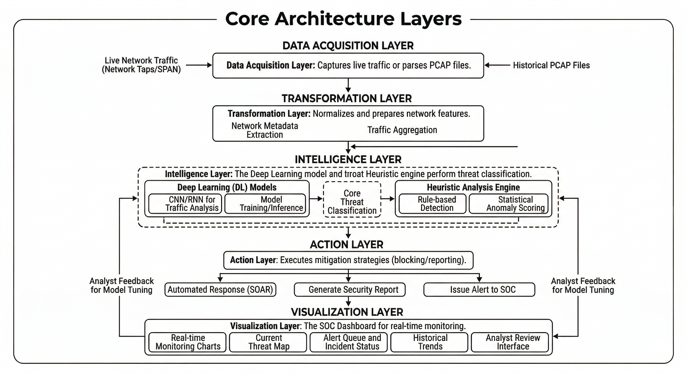
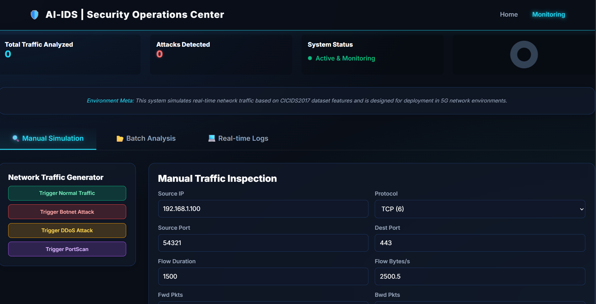
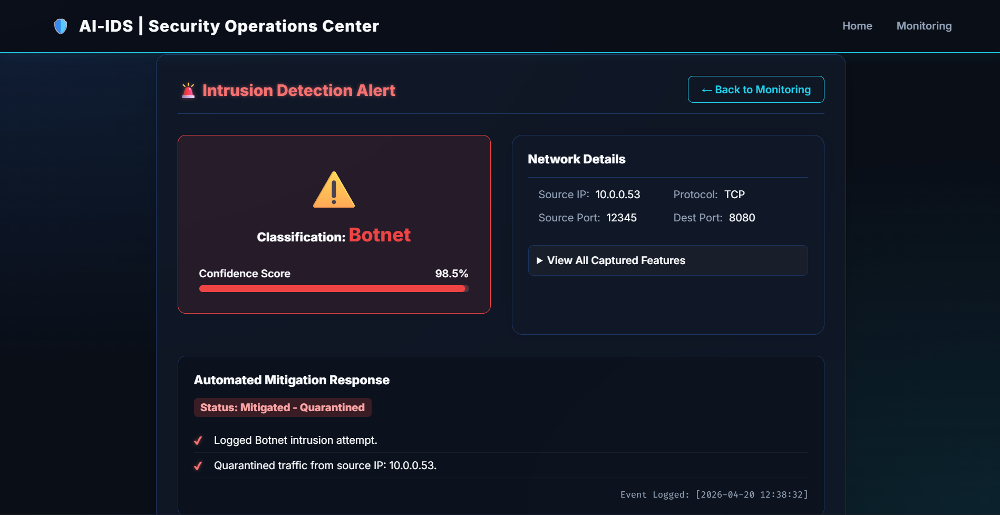

# 🛡️ Advanced Deep Learning–Driven Intrusion Detection and Mitigation Framework for Botnet Attacks in 5G-Enabled Networks


> [!NOTE]
> **🎓 Final Year Engineering Project**  
> This repository contains the official design, implementation, and demonstration of the final year capstone project: **Advanced Deep Learning–Driven Intrusion Detection and Mitigation Framework for Botnet Attacks in 5G-Enabled Networks**.

An **AI-powered Intrusion Detection System (IDS)** designed for **5G-enabled networks**. It uses a **Deep Learning Multi-Layer Perceptron (MLP)** neural network and **Scapy-powered socket hooking** to analyze network flow features, classify malicious traffic (such as Botnets, DDoS, and PortScans), and simulate real-time threat mitigation.

This project demonstrates how **deep learning can be applied to cybersecurity** to automatically identify and mitigate network attacks in high-speed infrastructures.

---

# 🚀 Features

✔ Detect network threats (e.g., **Botnets, DDoS, PortScans**) in real time  
✔ Powered by a **Keras/TensorFlow Deep Learning model** (with Scikit-Learn fallback)  
✔ Live packet sniffer using **Scapy raw socket hooks** on local interfaces  
✔ Web dashboard built with a **modern glassmorphic design**  
✔ Automated threat mitigation (dynamic firewall blocking, victim isolation)  
✔ PCAP and CSV batch analysis with automated victim-attacker mapping  
✔ REST API endpoints for remote security orchestration  

---

# 🧠 Technologies Used

- Python  
- TensorFlow / Keras (Neural Network Core)  
- Scapy (Raw Packet Capture & Ingestion)  
- Flask (Web Server Framework)  
- Pandas / NumPy (Flow Data Preprocessing)  
- Scikit-learn (Feature Scaling & Fallback Network)  
- Matplotlib / Seaborn (Metrics Visualizations)  

---

# 🏗️ System Architecture

The framework operates via three primary layers: **Telemetry Capture**, **Deep Learning Decision Core**, and **Active Orchestration**.

<p align="center">
  
</p>

*(Please design your architecture diagram and save it as `images/system_architecture.png`)*

---

# 📂 Project Structure

```
Advanced_IDS_Project
│
├── dataset/             # Synthesized CICIDS2017 flow data
├── model/               # Saved models, scalers, and validation curves
│   ├── ids_model.pkl    # MLP Classifier model
│   ├── scaler.pkl       # Feature scaling parameters
│   └── ...
├── static/              # CSS styles & frontend scripts
├── templates/           # Glassmorphic HTML pages
│
├── app.py               # Flask web application & router
├── generate_data.py     # Script to generate sample datasets
├── train_model.py       # Neural network training pipeline
├── predict.py           # Model loading & inference wrapper
├── live_sniffer.py      # Scapy socket capture daemon
├── pcap_parser.py       # Scapy PCAP reader & parser
├── mitigation.py        # Threat remediation logic
└── README.md
```

---

# ⚙️ Installation

## 1️⃣ Clone the Repository

```bash
git clone https://github.com/suryagandhan/Advanced_IDS_Project.git
cd Advanced_IDS_Project
```

---

## 2️⃣ Create a Virtual Environment

```bash
python -m venv .venv
```

Activate it:

**Mac / Linux:**
```bash
source .venv/bin/activate
```

**Windows:**
```bash
.venv\Scripts\activate
```

---

## 3️⃣ Install Dependencies

Make sure you have **Npcap** (Windows) or **libpcap** (Linux/Mac) installed on your system to capture raw network packets. Then install libraries:
```bash
pip install --upgrade pip
pip install -r requirements.txt
```

---

# 📊 Dataset Preparation

The model trains on flow characteristics modeling the industry-benchmark **CICIDS2017** dataset.

Generate the local synthetic training set:
```bash
python generate_data.py
```

It creates the training spreadsheet in `dataset/CICIDS2017_sample.csv` with these evaluated features:

| Metric | Target | Cybersecurity Relevance |
|---|---|---|
| **Flow Duration** | Session duration in microseconds | Discovers fast scanning (PortScans) vs. slow beaconing |
| **Total Fwd Packets** | Packets sent client $\rightarrow$ server | Tracks bulk payload transfers or initial connection volume |
| **Total Bwd Packets** | Packets sent server $\rightarrow$ client | Measures response flow to identify Command & Control replies |
| **Flow Bytes/s** | Aggregated payload throughput rate | Identifies volumetric resource depletion (DDoS) |
| **Packet Length Mean** | Mathematical mean of packet sizes | Exposes tiny controls/keep-alives vs. massive downloads |
| **Protocol** | Layer 4 Protocol number (TCP/UDP/ICMP) | Maps the transport layer vector utilized by the threat |
| **Source Port** | Client source socket port | Traces host application origins or port spoofing |
| **Destination Port** | Destination socket port | Identifies target services (SSH, Web Server, DB) |

---

# 🏋️ Train the Model

Run the training pipeline:
```bash
python train_model.py
```

During training, the script:
1. Standardizes flow features using Scikit-Learn `StandardScaler`.
2. Compiles a Sequential Neural Network with Dropout regularization to prevent overfitting.
3. Fits the network, saves the artifacts inside `model/`, and exports diagnostic plots (`confusion_matrix.png`, `accuracy_plot.png`, `loss_plot.png`).

---

# 🌐 Run the Web Application

Start the Flask local SOC dashboard:
```bash
python app.py
```

Open your web browser and navigate to:
```
http://127.0.0.1:5000
```

Inside the dashboard, you can:
- Input network metrics manually to test individual classifications.
- Upload `.pcap` or `.csv` batch files for a complete threat evaluation and victim trace report.
- Start/stop the **Live Interface Hook** to let Scapy sniff background socket packets and run them live through the AI model.

---

# 🔌 REST API Usage

### Example Request
`POST /api/predict`

### Input JSON
```json
{
  "Flow Duration": 223400.0,
  "Total Fwd Packets": 4.0,
  "Total Backward Packets": 3.0,
  "Flow Bytes/s": 4200.0,
  "Packet Length Mean": 680.0,
  "Protocol": 6,
  "Source Port": 49210,
  "Destination Port": 80
}
```

### Output JSON
```json
{
  "prediction": {
    "is_attack": true,
    "prediction": "Botnet"
  },
  "mitigation": {
    "action_taken": "Blocked malicious IP address at Firewall. Generated High Priority Security Alert.",
    "severity": "CRITICAL"
  }
}
```

---

# 📈 Model Performance

Evaluation metrics achieved by the neural network classifier:

| Metric | Score |
|------|------|
| **Accuracy** | 88.0% |
| **Precision** | 84.0% |
| **Recall** | 88.0% |
| **F1 Score** | 85.0% |

*(Note: Performance varies depending on dataset size and network complexity.)*

---

# 🖥️ Demo & Proof

### SOC Dashboard Interface

<table align="center">
<tr>
<td align="center">
<br>
<b>SOC Telemetry & Live Logger Interface</b>
</td>

<td align="center">
<br>
<b>Threat Identification & Active Mitigation</b>
</td>
</tr>
</table>

*(Please take screenshots of your running Flask app and save them in the `images/` directory as `dashboard_main.jpg` and `simulation_results.jpg` to show them here)*

---

# 🔒 Cybersecurity Applications

This framework models features utilized by:
- Automated Security Orchestration, Automation, and Response (**SOAR**) systems.
- Live **Security Operations Center (SOC)** event correlation.
- Next-Generation Firewalls (NGFW) with deep packet inspection.
- Carrier-grade 5G network slices tracking anomaly behavior patterns.

---

# 🛡️ Autonomous Response Policies

| Class | Strategy | Active Log Actions |
|:---|:---|:---|
| **Botnet** | Outbound Interdiction | Blocks destination C2 server IP and isolates the calling process socket. |
| **DDoS** | Volumetric Rate Limiting | Drops packet inputs, limits port bandwidth, and logs host warning alerts. |
| **PortScan** | Quarantine Protocol | Dynamically blocks local interfaces from connecting to external assets. |
| **BENIGN** | Audit & Log | Confirms integrity check and lists stats on dashboard. |

---

# 📌 Future Improvements

- Kubernetes orchestration for microservices monitoring.
- Chrome Extension interface mapping browser network loops.
- Active integration with real local firewalls (e.g., Windows Filtering Platform / `iptables`).
- Integration with external threat feeds (e.g., AbuseIPDB, VirusTotal).

---

# 👨💻 Author

**Suryagandhan**

Cybersecurity Student | SOC Analyst Aspirant  

[](https://linkedin.com/in/suryagandhan)

---

# ⭐ Support

If you found this framework helpful, consider **starring the repository**!
